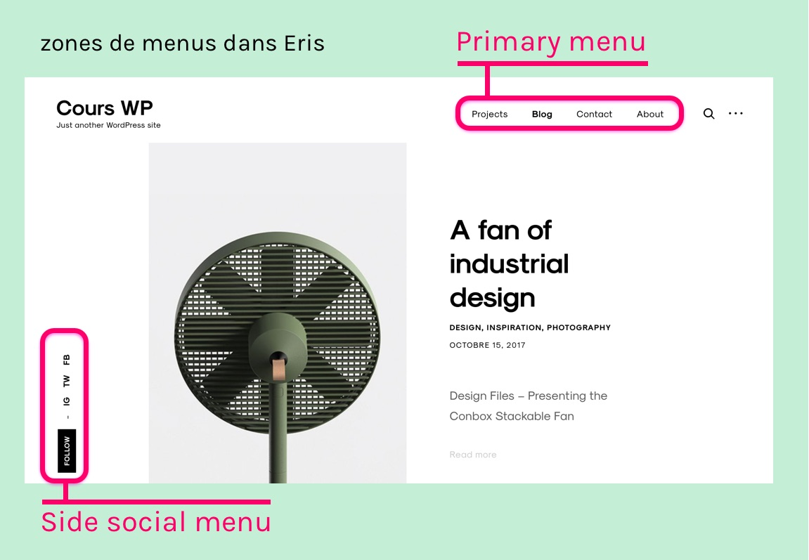

# Fonctionnement du thème Eris

Eris est un thème créé en 2016 par [Themes Kingdom](https://themeskingdom.com/).

Fonte par défaut: [Sk-Modernist](http://seankanedesign.com/work/sk-modernist), par Sean Kane. Incluse comme fichier webfont (version Bold et Regular).

### Modèles de page

Ce thème propose un modèle de page particuler: **Portfolio**. Son résultat est de présenter les projets du portfolio.

### Menus

Deux emplacements de menus sont disponibles:

- **Primary menu** : navigation principale
- **Side social menu** : menu secondaire

### Zones de widgets

Trois zones disponibles:

- **Sidebar**
- **Footer Widgets 1**
- **Footer Widgets 2**

### Extensions recommandées:

Lors de l'activation de Eris, vous verrez les indications suivantes :

- This theme **requires** the following plugin: Eris Custom Post Types.

- This theme **recommends** the following plugins: Eris Widgets, Flickr Bagdes Widget, TK Advertising Widget, TK Contact Form, TK Shortcodes, TK Social Share and Widget Visibility.

L'extension "Eris Custom Post Types" est nécessaire pour activer le type de contenu "Portfolio".

Les autres extensions sont recommandées, mais pas obligatoires.

**Eris widgets** : cette extension optionnelle active les widgets suivants:
- Facebook : permet d'afficher une "Facebook box".
- Instagram feed : "Displays your latest Instagram photos".
- Newsletter Widget : permet d'afficher un formulaire d'abonnement. Supporte les systèmes [MadMimi](https://madmimi.com/) et [MailChimp](https://mailchimp.com/).
- Twitter Feed : permet d'afficher les derniers tweets d'un compte twitter.

***

Page de démonstration: [http://eris.tkdemos.com/](http://eris.tkdemos.com/)

Démonstration avec fond noir: [http://eris1.tkdemos.com/](http://eris1.tkdemos.com/)  
Fonte typographique: Playfair Display, Droid Serif

***

Documentation officielle: [https://help.themeskingdom.com/docs/eris/](https://help.themeskingdom.com/docs/eris/)